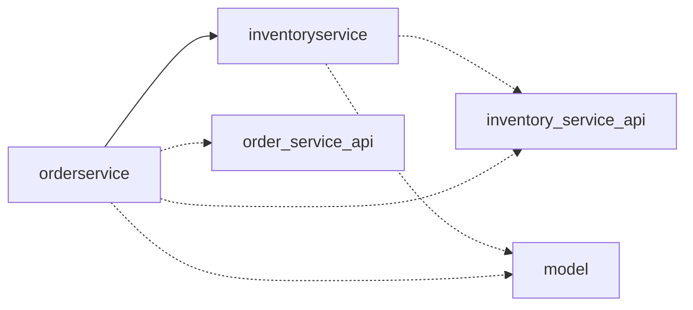

# Implementation Rules

> **These rules apply to every task file in `spec/task*.md`.**
> Read this once before starting any implementation.

---

## Project layout

| Entry | Location |
|-------|----------|
| Project root | `example/` |
| Graph definition | `example/graph/example.generated.yaml` |
| Service `Inventory Service` | `inventoryservice/` · `github.com/gorundebug/inventoryservice` |
| Service `Order Service` | `orderservice/` · `github.com/gorundebug/orderservice` |
| Module `inventory_service_api` | `inventory_service_api/` · `github.com/gorundebug/inventory_service_api` |
| Module `model` | `model/` · `github.com/gorundebug/model` |
| Module `order_service_api` | `order_service_api/` · `github.com/gorundebug/order_service_api` |

---

## Service dependencies

### `Inventory Service`

| | |
|-|-|
| Module | `github.com/gorundebug/inventoryservice` |
| Directory | `inventoryservice/` |
| Uses modules | `inventory_service_api`, `model` |

### `Order Service`

| | |
|-|-|
| Module | `github.com/gorundebug/orderservice` |
| Directory | `orderservice/` |
| Calls | `inventoryservice` |
| Uses modules | `inventory_service_api`, `model`, `order_service_api` |



---

```bash
# Full graph
cat example/graph/example.generated.yaml

# All TODO stubs
grep -rn "TODO" example/*/internal/functions/
grep -rn "TODO" example/*/pkg/functions/

# Build
cd example && make build

# Test
cd example && make test
```

---

## Core rule (HIGHEST PRIORITY)

> Generation artifacts and contracts are fixed.
> Extension is allowed only via addition, never via modification.

- Do NOT modify generated files (any generated Go code)
- Do NOT change signatures of generated functions
- Do NOT change names of generated types
- Do NOT modify runtime wiring, graph topology, or service bootstrap code

---

## Import rule

Business logic files import **only `transformation`**. Never import `operators` or `runtime` packages directly.

---

## Serialization rule

Add serde **only** for types persisted to external storage. In-process types must NOT have serde.

Serde stubs are already generated — implement the `Serialize` / `Deserialize` methods inside them, do not create new serde files.

For `EndpointHandler[HandlerState, ReqT, ResR, T, R, E any]`:
- Do NOT write separate serde for `ReqT` / `ResR`
- Serialize/deserialize directly inside `ConsumeMessage()` / `HandleResponse()` using `encoding/json`, `proto.Marshal`/`proto.Unmarshal`, or the appropriate codec

---

## Function struct lifecycle

Each function struct is instantiated once at startup by its `Make*` constructor.
Do not hold shared mutable state without synchronisation.

---

## Function interfaces

| Type | Method |
|------|--------|
| Map | `Map(ctx, stream, value In, out Collect[Out])` |
| Filter | `Filter(ctx, stream, value T, out Collect[T]) bool` |
| FlatMap | `FlatMap(ctx, stream, value In, out Collect[Out])` |
| Process | `Process(ctx, stream, value In, out Collect[Out])` |
| KeyBy | `KeyBy(ctx, stream, value V) K` |
| Join | `Join(ctx, stream, key K, left L, right R, out Collect[Out])` |
| MultiJoin | `MultiJoin(ctx, stream, key K, values []T, out Collect[Out])` |
| Case | `Case(ctx, stream, value T) int` |
| Delay | `Delay(ctx, stream, value T) time.Duration` |

---

## EndpointHandler

```go
type EndpointHandler[HandlerState, ReqT, ResR, T, R, E any] interface
```

- `ReqT`, `ResR` — external transport types (OpenAPI / Protobuf)
- `T`, `R` — internal stream domain types

HTTP sink lifecycle:
```
MakeClient() → BeginRequest() → ConsumeMessage() → [HTTP call] → HandleResponse() → EndRequest()
```

| Connector | File | `EndpointHandler` line |
|-----------|------|------------------------|
| HTTP source | `$SERVICELIB/datasource/http/nethttp.go` | 131 |
| HTTP sink   | `$SERVICELIB/datasink/http/nethttp.go`   | 85  |
| gRPC source | `$SERVICELIB/datasource/grpc/grpc.go`    | 197 |
| gRPC sink   | `$SERVICELIB/datasink/grpc/grpc.go`      | 85  |

```bash
SERVICELIB=$(go list -m -json github.com/gorundebug/servicelib | grep '"Dir"' | awk -F'"' '{print $4}')
```

---

## Context propagation

```go
ctx = runtime.WithStreamId(ctx, streamID)  // inject
id  = runtime.StreamIdFromContext(ctx)     // extract
```

---

## OpenAPI / Proto type rules

- You MAY extend types with additional fields
- You MAY add helper / derived structures
- Do NOT rename existing fields or types
- Do NOT modify generated Go representations directly — change the source schema and regenerate

Do NOT use `bytes message = 1` for structured data. Always use explicit typed fields.

---

## Stream (runtime) type rules

- You MAY extend types with additional fields
- Do NOT rename existing types
- Do NOT modify generated stream contracts

---

## Tests

- You MUST implement all `*_test.go` files
- You MAY modify test logic and assertions
- You MAY add helper functions inside test files
- Do NOT move tests outside their module

---

## Allowed scope

- Implement business logic according to function specs
- Use only `transformation`, standard library, and provided clients
- Add helper files inside the same bounded module when required
- Rely on generated types without modifying them

---

## Implementation order

1. Pure in-process transformations: Map, Filter, KeyBy, Join
2. Domain types required by the above
3. Endpoint handlers: HTTP source/sink, gRPC
4. Functions depending on external state or other services
5. Test cases in `*_test.go` stubs

---

## Progress tracking rule

**Close each task immediately after implementing it** — do not batch all progress.md updates to the end.

After finishing a task, copy the **exact** append block from that task's checklist into `spec/progress.md`. The format varies:

- Pure transformation tasks → one-liner: `- [x] taskN.md — FunctionName — done`
- Endpoint tasks (http-source, grpc-source) → multi-line block with `Example call:` section

The endpoint checklist item reads:
> Verify the endpoint works and append to `spec/progress.md`: …

That multi-line block **must** be used verbatim for endpoint tasks. Do not substitute the one-liner format.

---

## Priority of truth

1. Task specification (`spec/task*.md`)
2. Graph definition (`graph/*.yaml`)
3. Type definitions (generated code)
4. Runtime behaviour of servicelib
